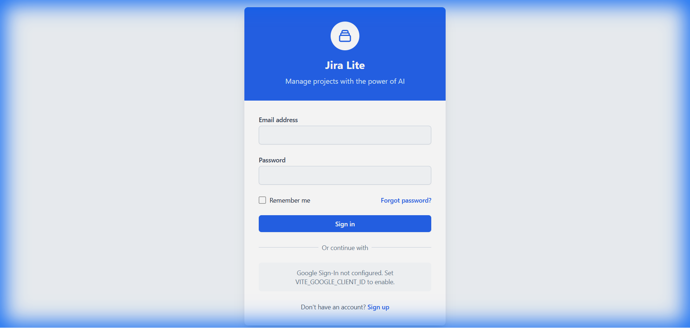
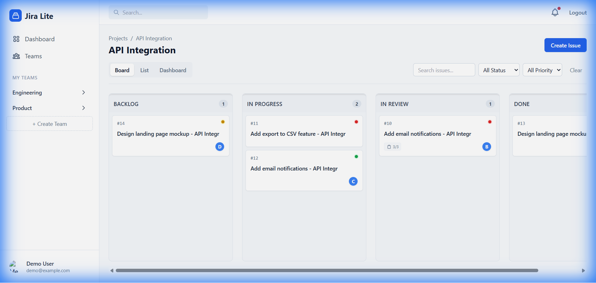
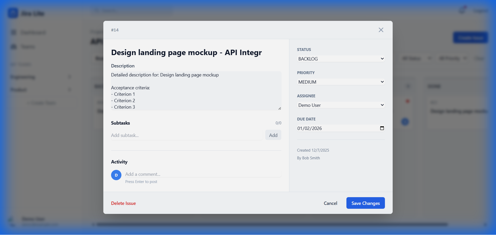
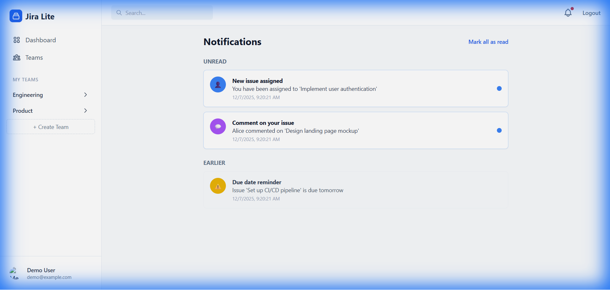
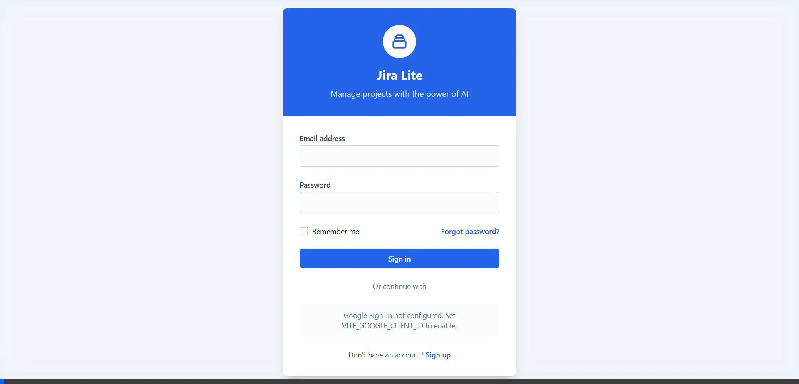

# Jira Lite MVP - Application Verification Walkthrough

## ✅ Both Frontend and Backend are Running Correctly

### Backend Status (FastAPI - Port 8000)
- **Health Check**: `{"status": "healthy"}`
- **API Documentation**: Available at http://localhost:8000/docs

#### Verified API Endpoints:
| Category | Endpoints |
|----------|-----------|
| **Authentication** | Login, Signup, OAuth, Profile |
| **Teams** | CRUD, Members, Invites |
| **Projects** | CRUD, Labels, Favorites |
| **Issues** | CRUD, Status, AI Features, Subtasks |
| **Comments** | CRUD per Issue |
| **Notifications** | List, Mark as Read |


---

### Frontend Status (React/Vite - Port 3000)
- **Login Page**: ✅ Loaded correctly with email/password fields
- **Google OAuth**: Note displayed (not configured - needs `VITE_GOOGLE_CLIENT_ID`)



---

## Tested Features

### 1. Authentication
- **Login**: ✅ Works with `demo@example.com` / `demo123`
- Session maintained after login

### 2. Dashboard
- ✅ Displays user-specific information
- Shows teams and projects

### 3. Teams & Projects
- **Teams visible**: Engineering, Product
- **Projects visible**: API Integration, Website Redesign, Mobile App v2.0, etc.

### 4. Kanban Board
- ✅ Project board loads correctly
- Displays issue columns by status



### 5. Issue Modal
- ✅ Issue details open in modal
- Shows title, description, assignee, priority, status



### 6. Notifications
- ✅ Notifications page loads
- Shows "Unread" and "Earlier" notification sections



---

## PRD Compliance Summary

### ✅ Implemented Features
| PRD Requirement | Status |
|-----------------|--------|
| FR-001: Sign Up | ✅ |
| FR-002: Login/Logout | ✅ |
| FR-004: Google OAuth | ⚠️ (Not configured - needs client ID) |
| FR-010-019: Team Management | ✅ |
| FR-020-027: Project Management | ✅ |
| FR-030-039: Issue Management | ✅ |
| FR-050-054: Kanban Board | ✅ |
| FR-060-063: Comments | ✅ |
| FR-090-091: Notifications | ✅ |

### ⚠️ Notes
1. **Google OAuth**: Frontend shows "Google Sign-In is not configured". Needs `VITE_GOOGLE_CLIENT_ID` environment variable.
2. **AI Features**: Not tested - requires AI provider configuration (Gemini API key in `.env`)
3. **Email Sending**: Not tested - requires SMTP configuration

---

## Test Credentials
```
Email: demo@example.com
Password: demo123

Alternative:
Email: alice@example.com
Password: password123
```

## Full Application Flow Recording

